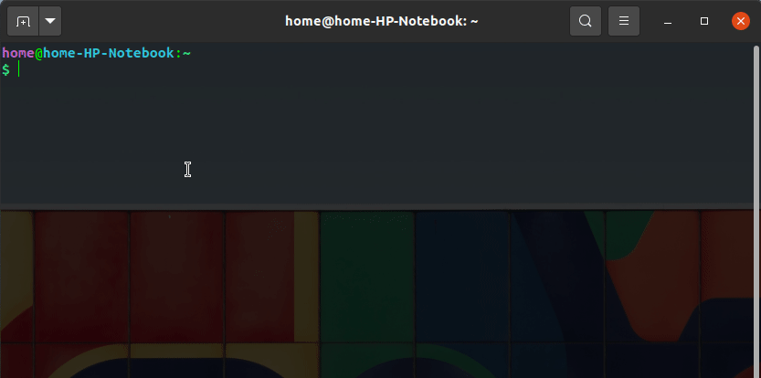
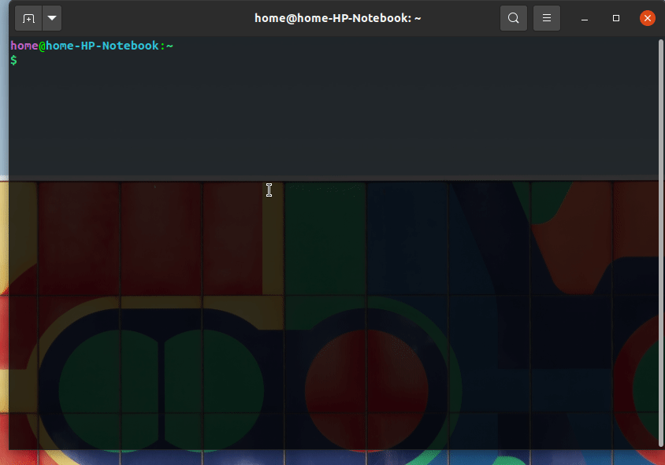

# CLI_Share

### What is CLI Share

Its a new way to share files over the internet without installing any program or visiting any websites, You only need active internet connection and CURL tool which is by default
available on all major OS.

 * Use CURL tool to upload your file to our server
 * 4 digit Token will be generated 
 * using this token you can download your file within next 2 hours 

### What about safety of my DATA 

 * The generated token is hashified using md5 hashing algorithm an at no point we store your original token we just store your md5 hash so its impossible for use to guess your token
 * Your Files will be deleted automatically after 2 Hours from out server
 * We continue to Harden Our Servers Security over the time

### Sound Awesome how do i Start Using It 

Below is the demo on how You can Start Using It

 
  
<b> Uploading a file </b>

      
 

 
  
<b> Downloading a file </b>

     
 

### To do Work

 * implement MD5 